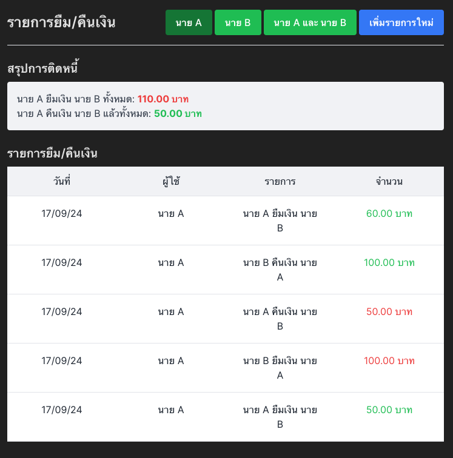

# ยืมตัง Application

Application นี้เป็น Frontend Service สำหรับการยืมเงินรหว่างสองบุคคล



## ตารางหัวข้อ

- [การติดตั้ง](#การติดตั้ง)
- [การใช้งาน](#การใช้งาน)
- [Dependencies](#dependencies)

## การติดตั้ง

1. **ทำการโคลน Repository:**

   ```bash
   git clone git@github.com:prechak/Yeumtang.git
   cd Yeumtang/client
   ```

2. **ติดตั้ง Dependencies:**
   ```bash
   npm install axios react react-dom react-loading-skeleton
   ```

## การใช้งาน

### ก่อนเริ่มใช้งานควรเปิด Backend Service ก่อนเพื่อดึงข้อมูลจากฐานข้อมูลที่:
https://github.com/prechak/Yeumtang/tree/main/server

1. **การเริ่มต้นใช้งาน**

   ```bash
   npm run start
   ```

เปิด Browser ขึ้นมาแล้วไปที่ http://localhost:5173 เพื่อเข้าใช้งาน Application

## Dependencies

- `axios`
- `react`
- `react-dom`
- `react-loading-skeleton`
